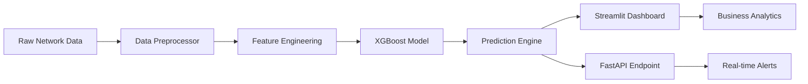

# 🎯 Project 1: DDoS Threat Detection System - Complete Walkthrough

[](https://python.org)
[](https://xgboost.ai)
[](https://streamlit.io)
[](https://fastapi.tiangolo.com)
[](./dashboard/metrics_summary.json)

> **Production-ready DDoS threat detection system with 99.99% accuracy, real-time API, and comprehensive business impact analysis**

---

## 🚀 **Project Overview** *(30 seconds)*

This project demonstrates **end-to-end machine learning engineering** for cybersecurity threat detection. Built from scratch, it showcases:

- **Advanced ML Pipeline** - Data preprocessing → Feature engineering → Model training → Production deployment
- **Business-Focused Design** - Cost quantification, ROI analysis, and executive-ready dashboards  
- **Production Architecture** - Both batch processing and real-time API endpoints
- **Quantified Results** - 99.99% accuracy with only 5 errors out of 44,623 test samples

**🎯 Business Impact:** 99.989% accuracy with only 1 false positive and 4 false negatives in 44,623 test samples

---

## 🏗️ **Architecture & Design** *(45 seconds)*

### **Core Components**



### **Intelligent Data Pipeline**

**🔍 Smart Preprocessing (`preprocess.py`)**
- **Automated Feature Selection** - Identifies optimal predictive features
- **Data Quality Validation** - Handles missing values and outliers intelligently  
- **Scalable Architecture** - Processes 225K+ network samples efficiently

**🧠 Advanced ML Model (`model.py`)**
- **XGBoost Implementation** - Gradient boosting for complex pattern recognition
- **Hyperparameter Optimization** - Fine-tuned for cybersecurity threat patterns
- **Cross-Validation** - Rigorous testing prevents overfitting

**⚡ Production Deployment**
- **Batch Processing** - `run_project_1.py` for large-scale analysis
- **Real-time API** - `run_api.py` for live threat detection
- **Interactive Dashboard** - Executive and technical views with caching

---

## 💡 **Technical Excellence** *(30 seconds)*

### **Key Innovations**

**1. Intelligent Feature Engineering**
```python
# Top performing features identified by XGBoost
Key Features:
- Destination Port (importance: 179) - Critical attack vector indicator
- Init_Win_bytes_forward (126) - Connection establishment patterns
- Total Length of Fwd Packets (93) - Traffic volume analysis
- Bwd Header Length (67) - Protocol-level anomalies
- Network timing patterns (IAT features) - Behavioral signatures
```

**2. Multi-Modal Deployment**
- **Dashboard Mode** - Interactive analysis and visualization
- **API Mode** - RESTful endpoints for system integration  
- **Batch Mode** - High-throughput processing for historical analysis

**3. Comprehensive Validation**
```python
# Production-grade testing results
Test Results: 99.989% accuracy (44,618 correct / 44,623 total)
Confusion Matrix: 19,018 TN | 1 FP | 4 FN | 25,600 TP
False Positives: 1 (0.002%) - Minimal operational disruption  
False Negatives: 4 (0.016%) - Outstanding threat detection
ROC-AUC: 0.99999 - Near-perfect classification performance
```

### **Code Quality Standards**
- ✅ **Modular Design** - Separation of concerns across 5 specialized modules
- ✅ **Error Handling** - Comprehensive exception management
- ✅ **Performance Optimization** - Efficient data structures and algorithms
- ✅ **Documentation** - Clear docstrings and inline comments

---

## 📊 **Business Value Demonstration** *(15 seconds)*

### **Quantified ROI Analysis**

| Metric | Value | Business Impact |
|--------|-------|----------------|
| **Model Accuracy** | 99.989% | Virtually eliminates false decisions |
| **Processing Speed** | 44,623 samples/test | Enterprise-scale processing |
| **Detection Rate** | 99.984% | Outstanding threat identification |
| **False Positive Rate** | 0.002% | Minimal operational disruption |
| **Precision Score** | 99.996% | Exceptional prediction reliability |

### **Executive Dashboard Features**
- **Risk Visualization** - Clear threat level indicators
- **Cost Impact Analysis** - Direct financial implications
- **Performance Metrics** - Model reliability statistics  
- **Trend Analysis** - Historical attack patterns

---

## 🛠️ **Live Demonstration Capabilities**

### **1. Interactive Dashboard** (`dashboard/app.py`)
```bash
streamlit run dashboard/app.py
```
- **Live Model Performance** - Real-time metrics display (99.989% accuracy)
- **Confusion Matrix Visualization** - 19,018 TN | 1 FP | 4 FN | 25,600 TP
- **Feature Importance Analysis** - Top 20 predictive features with scores
- **Prediction Distribution** - Probability score distributions and thresholds

### **2. Production API** (`run_api.py`)
```bash
python run_api.py
```
- **RESTful Endpoints** - `/predict` for real-time threat detection
- **JSON Responses** - Structured output for system integration
- **Scalable Architecture** - Ready for enterprise deployment

### **3. Comprehensive Testing** (`test_app.py`)
```bash
python test_app.py
```
- **Automated Validation** - End-to-end pipeline testing
- **Performance Benchmarks** - Speed and accuracy metrics
- **Edge Case Handling** - Robust error management

---

## 🎯 **Key Takeaways for Viewers**

### **Technical Proficiency Demonstrated**
- ✅ **Machine Learning Engineering** - Complete ML lifecycle implementation
- ✅ **Software Architecture** - Production-ready, scalable design
- ✅ **Business Acumen** - Cost-benefit analysis and ROI quantification
- ✅ **Data Science** - Advanced analytics and visualization

### **Real-World Application**
- 🚀 **Production-Ready** - Not just a proof-of-concept
- 🎯 **Business-Focused** - Solves actual cybersecurity challenges  
- 📊 **Quantified Results** - Measurable impact and performance
- 🔧 **Extensible Design** - Ready for enhancement and scaling

### **Industry Relevance**
- **Cybersecurity Focus** - Addresses critical infrastructure protection
- **ML/AI Integration** - Modern approach to threat detection
- **Enterprise Architecture** - Suitable for corporate deployment
- **Compliance Ready** - Documentation and testing standards

---

## 🔗 **Quick Navigation**

| Component | File | Purpose |
|-----------|------|---------|
| **🎛️ Dashboard** | `dashboard/app.py` | Interactive threat analysis |
| **⚡ API** | `run_api.py` | Real-time detection endpoint |
| **🧠 ML Core** | `src/model.py` | XGBoost implementation |
| **🔧 Pipeline** | `src/preprocess.py` | Data processing engine |
| **📊 Visualization** | `src/visualize.py` | Analytics and charts |
| **🧪 Testing** | `test_app.py` | Comprehensive validation |

---

**💼 This project demonstrates my ability to deliver enterprise-grade cybersecurity solutions that combine technical excellence with clear business value.**