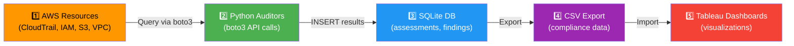
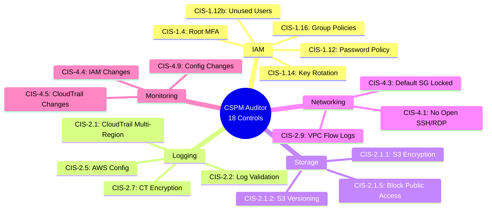

# Project 3: Cloud Security Posture Management (CSPM) Auditor

## Architecture Overview

This document provides a high-level view of the complete 6-layer architecture for the AWS CIS Compliance Auditor.

## 📐 Architecture Diagram

```mermaid
graph TB
    subgraph "Layer 6: Orchestration & CLI"
        CLI["🎮 CLI Interface<br/>cli.py"]
        CLI_CMDS["Commands:<br/>• audit --all<br/>• report --format tableau<br/>• drift-detect"]
    end

    subgraph "Layer 5: Visualization & Reporting"
        TABLEAU["📊 Tableau Public Dashboards"]
        DASH1["Dashboard 1:<br/>Compliance Scorecard"]
        DASH2["Dashboard 2:<br/>Control Details"]
        DASH3["Dashboard 3:<br/>Findings Queue"]
        DASH4["Dashboard 4:<br/>Infrastructure Map"]
    end

    subgraph "Layer 4: Data Persistence"
        DB["💾 SQLite Database<br/>compliance.db"]
        TABLE1["Table: controls"]
        TABLE2["Table: assessments"]
        TABLE3["Table: findings"]
        TABLE4["Table: evidence_artifacts"]
    end

    subgraph "Layer 3: Compliance Auditors (Python + boto3)"
        BASE["🔧 base_auditor.py<br/>(AWS Session Mgmt)"]
        IAM["👤 iam_auditor.py<br/>5 Controls"]
        LOG["📝 logging_auditor.py<br/>4 Controls"]
        STOR["💿 storage_auditor.py<br/>3 Controls"]
        NET["🌐 network_auditor.py<br/>3 Controls"]
        MON["📈 monitoring_auditor.py<br/>3 Controls"]
    end

    subgraph "Layer 2: Infrastructure as Code (Terraform)"
        TF_MAIN["terraform/main.tf"]
        TF_IAM["terraform/iam.tf"]
        TF_CT["terraform/cloudtrail.tf"]
        TF_S3["terraform/s3.tf"]
        TF_VPC["terraform/vpc.tf"]
        TF_KMS["terraform/kms.tf"]
        TF_CFG["terraform/config.tf"]
    end

    subgraph "Layer 1: AWS Cloud Infrastructure"
        AWS_IAM["☁️ IAM<br/>Users, Roles,<br/>Policies"]
        AWS_CT["☁️ CloudTrail<br/>Multi-Region<br/>Audit Logs"]
        AWS_S3["☁️ S3<br/>Encrypted<br/>Versioned Buckets"]
        AWS_VPC["☁️ VPC<br/>Flow Logs<br/>Security Groups"]
        AWS_KMS["☁️ KMS<br/>Encryption<br/>Keys"]
        AWS_CFG["☁️ AWS Config<br/>Resource<br/>Tracking"]
    end

    %% Layer connections
    CLI --> BASE
    BASE --> IAM
    BASE --> LOG
    BASE --> STOR
    BASE --> NET
    BASE --> MON

    IAM -->|boto3 API| AWS_IAM
    LOG -->|boto3 API| AWS_CT
    LOG -->|boto3 API| AWS_CFG
    STOR -->|boto3 API| AWS_S3
    NET -->|boto3 API| AWS_VPC
    MON -->|boto3 API| AWS_CT

    IAM -->|Save Results| DB
    LOG -->|Save Results| DB
    STOR -->|Save Results| DB
    NET -->|Save Results| DB
    MON -->|Save Results| DB

    DB -->|CSV Export| TABLEAU
    TABLEAU --> DASH1
    TABLEAU --> DASH2
    TABLEAU --> DASH3
    TABLEAU --> DASH4

    TF_MAIN -.->|Deploy| AWS_IAM
    TF_IAM -.->|Deploy| AWS_IAM
    TF_CT -.->|Deploy| AWS_CT
    TF_S3 -.->|Deploy| AWS_S3
    TF_VPC -.->|Deploy| AWS_VPC
    TF_KMS -.->|Deploy| AWS_KMS
    TF_CFG -.->|Deploy| AWS_CFG

    CLI_CMDS -.->|Part of| CLI
    TABLE1 -.->|Schema| DB
    TABLE2 -.->|Schema| DB
    TABLE3 -.->|Schema| DB
    TABLE4 -.->|Schema| DB

    style CLI fill:#e1f5ff
    style TABLEAU fill:#fff4e1
    style DB fill:#f0f0f0
    style BASE fill:#e8f5e9
    style AWS_IAM fill:#ff9800
    style AWS_CT fill:#ff9800
    style AWS_S3 fill:#ff9800
    style AWS_VPC fill:#ff9800
    style AWS_KMS fill:#ff9800
    style AWS_CFG fill:#ff9800
```



### Data Flow



### Control Coverage Map




## 🏗️ **6-Layer Architecture**

```
┌─────────────────────────────────────────────────────────────────┐
│                   LAYER 1: CLOUD INFRASTRUCTURE                 │
│                          (AWS Free Tier)                        │
├─────────────────────────────────────────────────────────────────┤
│                                                                 │
│  AWS Resources (Deployed via Terraform):                        │
│  • IAM: Root MFA, password policy, access keys                  │
│  • CloudTrail: Multi-region audit logging with encryption       │
│  • S3: Buckets with versioning, encryption, access controls     │
│  • VPC: Flow logs, security groups, network segmentation        │
│  • KMS: Encryption keys for data at rest                        │
│  • AWS Config: Compliance monitoring and recording              │
│                                                                 │
│  Cost: $0/month (Free Tier)                                     │
│                                                                 │
└─────────────────────────────────────────────────────────────────┘
                              ▼
┌─────────────────────────────────────────────────────────────────┐
│              LAYER 2: INFRASTRUCTURE AS CODE                    │
│                      (Terraform)                                │
├─────────────────────────────────────────────────────────────────┤
│                                                                 │
│  terraform/                                                     │
│  ├── main.tf              # Provider, backend config            │
│  ├── iam.tf               # IAM policies, password policy       │
│  ├── cloudtrail.tf        # Audit trail with encryption         │
│  ├── s3.tf                # Compliant S3 buckets                │
│  ├── vpc.tf               # VPC with flow logs                  │
│  ├── kms.tf               # Encryption keys                     │
│  ├── config.tf            # AWS Config setup                    │
│  ├── variables.tf         # Input parameters                    │
│  └── outputs.tf           # Resource ARNs/IDs                   │
│                                                                 │
│  Purpose: Version-controlled, repeatable infrastructure         │
│                                                                 │
└─────────────────────────────────────────────────────────────────┘
                              ▼
┌─────────────────────────────────────────────────────────────────┐
│               LAYER 3: COMPLIANCE AUDITORS                      │
│                    (Python + boto3)                             │
├─────────────────────────────────────────────────────────────────┤
│                                                                 │
│  auditors/                                                      │
│  ├── base_auditor.py      # Base class with AWS session mgmt    │
│  ├── iam_auditor.py       # 5 IAM controls (MFA, passwords)     │
│  ├── logging_auditor.py   # 5 logging controls (CloudTrail)     │
│  ├── storage_auditor.py   # 4 S3 controls (encryption)          │
│  ├── network_auditor.py   # 3 VPC controls (flow logs, SGs)     │
│  └── monitoring_auditor.py# 3 CloudWatch alarm controls         │
│                                                                 │
│  models/                                                        │
│  ├── control.py           # CIS control definition              │
│  ├── assessment.py        # Assessment result model             │
│  ├── finding.py           # Non-compliant finding model         │
│  └── evidence.py          # Evidence artifact model             │
│                                                                 │
│  Purpose: Query AWS APIs, evaluate against CIS Benchmark        │
│                                                                 │
└─────────────────────────────────────────────────────────────────┘
                              ▼
┌─────────────────────────────────────────────────────────────────┐
│                LAYER 4: DATA PERSISTENCE                        │
│                   (SQLite Database)                             │
├─────────────────────────────────────────────────────────────────┤
│                                                                 │
│  data/compliance.db                                             │
│                                                                 │
│  Tables:                                                        │
│  ┌─────────────────────────────────────────┐                   │
│  │ controls                                │                   │
│  │ • control_id, framework, title          │                   │
│  │ • description, severity, category       │                   │
│  └─────────────────────────────────────────┘                   │
│                                                                 │
│  ┌─────────────────────────────────────────┐                   │
│  │ assessments                             │                   │
│  │ • id, control_id, date, status, score   │                   │
│  │ • evidence_path, notes, assessor        │                   │
│  └─────────────────────────────────────────┘                   │
│                                                                 │
│  ┌─────────────────────────────────────────┐                   │
│  │ findings                                │                   │
│  │ • id, control_id, severity, description │                   │
│  │ • remediation, status, due_date         │                   │
│  └─────────────────────────────────────────┘                   │
│                                                                 │
│  ┌─────────────────────────────────────────┐                   │
│  │ evidence_artifacts                      │                   │
│  │ • id, assessment_id, type, file_path    │                   │
│  │ • hash_sha256, collected_date           │                   │
│  └─────────────────────────────────────────┘                   │
│                                                                 │
│  Purpose: Store assessment results, findings, evidence          │
│                                                                 │
└─────────────────────────────────────────────────────────────────┘
                              ▼
┌─────────────────────────────────────────────────────────────────┐
│              LAYER 5: VISUALIZATION & REPORTING                 │
│                      (Tableau Public)                           │
├─────────────────────────────────────────────────────────────────┤
│                                                                 │
│  Dashboard 1: Compliance Scorecard                              │
│  • Overall compliance percentage (17/20 = 85%)                  │
│  • Pass/Fail/Exempt breakdown                                   │
│  • Compliance by category (IAM, Logging, Storage, Network)      │
│  • Trend over time (60% → 75% → 85%)                            │
│                                                                 │
│  Dashboard 2: Control Details (Drill-Down)                      │
│  • Individual control status with evidence links                │
│  • Compliance history timeline per control                      │
│  • Business impact explanations                                 │
│                                                                 │
│  Dashboard 3: Findings & Remediation Queue                      │
│  • Open findings by severity (Critical/High/Medium/Low)         │
│  • Remediation steps and due dates                              │
│  • Priority heatmap (severity × category)                       │
│                                                                 │
│  Dashboard 4: Infrastructure Map                                │
│  • Terraform-managed resources visualization                    │
│  • Compliance status by resource type                           │
│  • Network diagram with security group rules                    │
│                                                                 │
│  Publishing: Tableau Public (free, shareable link)              │
│                                                                 │
└─────────────────────────────────────────────────────────────────┘
                              ▼
┌─────────────────────────────────────────────────────────────────┐
│                  LAYER 6: ORCHESTRATION                         │
│                 (Python CLI & Automation)                       │
├─────────────────────────────────────────────────────────────────┤
│                                                                 │
│  cli.py - Main entry point                                      │
│                                                                 │
│  Commands:                                                      │
│  • audit --all              Run all 20 CIS auditors             │
│  • audit --control CIS-1.4  Run specific control                │
│  • remediate --finding 42   Apply automated fix                 │
│  • report --format tableau  Export CSVs for Tableau             │
│  • drift-detect             Compare Terraform vs actual AWS     │
│  • export-evidence          Package all evidence artifacts      │
│                                                                 │
│  Example Usage:                                                 │
│  $ python cli.py audit --all                                    │
│                                                                 │
│  Running CIS AWS Compliance Audit...                            │
│  [1/20] CIS-1.4 Root MFA............✅ PASS                     │
│  [2/20] CIS-1.12 Password Policy....✅ PASS                     │
│  [3/20] CIS-1.20 Access Key Age.....❌ FAIL                     │
│                                                                 │
│  Audit complete: 17/20 passed (85%)                             │
│  3 findings saved to compliance.db                              │
│  Evidence collected in ./evidence/                              │
│                                                                 │
└─────────────────────────────────────────────────────────────────┘
```

---

## 📊 **Data Flow Summary**

```
AWS Infrastructure
  ↓ (boto3 API calls)
Python Auditors
  ↓ (INSERT statements)
SQLite Database
  ↓ (CSV export)
Tableau Dashboard
```

---

## 🎯 **20 CIS Controls Covered**

**Identity & Access (5)**
- CIS-1.4: Root MFA enabled
- CIS-1.12: Strong password policy
- CIS-1.16: IAM policies on groups
- CIS-1.20: Access key rotation
- CIS-1.22: Disable unused IAM users

**Logging & Monitoring (5)**
- CIS-2.1: CloudTrail multi-region
- CIS-2.2: Log file validation
- CIS-2.3: S3 bucket logging
- CIS-2.5: AWS Config enabled
- CIS-2.7: CloudTrail encryption

**Storage Security (4)**
- CIS-2.1.1: S3 encryption
- CIS-2.1.2: S3 versioning
- CIS-2.1.3: S3 MFA delete
- CIS-2.1.4: Block public access

**Network Security (3)**
- CIS-4.1: VPC flow logs
- CIS-4.2: Default SG restrictive
- CIS-4.3: No overly permissive rules

**Monitoring Alarms (3)**
- CIS-3.1: Unauthorized API calls
- CIS-3.2: Console login without MFA
- CIS-3.3: Root account usage

---

## 💰 **Cost: $0/month**

All tools and services used are 100% free tier:
- AWS Free Tier (12 months)
- Terraform (open-source)
- Python + boto3 (free)
- SQLite (public domain)
- Tableau Public (free)
- GitHub (free)

---

## 📁 **Project Structure**

```
project-3-cloud-security/
├── terraform/              # Layer 2: Infrastructure as Code
├── auditors/               # Layer 3: Compliance checkers
├── models/                 # Data models
├── data/                   # Layer 4: SQLite database
├── evidence/               # Evidence artifacts
├── tableau/                # Layer 5: Dashboard exports
├── cli.py                  # Layer 6: Orchestration
├── requirements.txt        # Python dependencies
├── README.md               # Project documentation
└── docs/                   # Planning documents
    ├── ARCHITECTURE.md     # This file
    ├── IMPLEMENTATION_PLAN.md
    └── TASK_CHECKLIST.md
```

---

## 🚀 **Quick Start (When Ready to Build)**

```bash
# 1. Set up AWS account
aws configure

# 2. Deploy infrastructure
cd terraform
terraform init
terraform apply

# 3. Run audits
python cli.py audit --all

# 4. Generate Tableau exports
python cli.py report --format tableau

# 5. Build dashboards in Tableau Public
```

---

**Status:** Planning phase - ready to begin implementation
